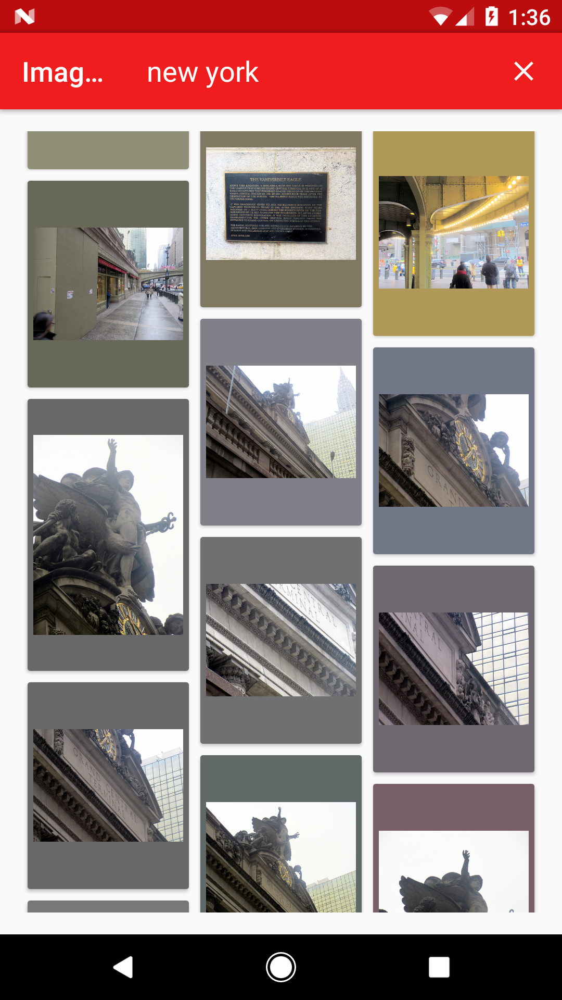
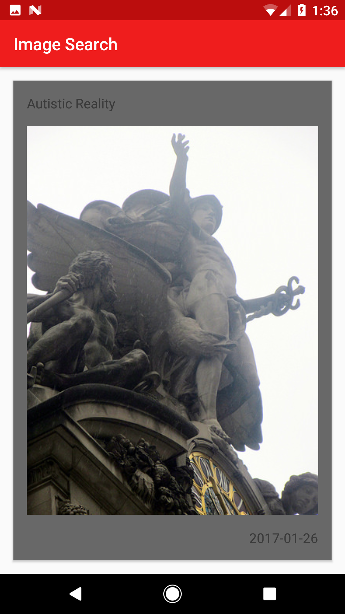
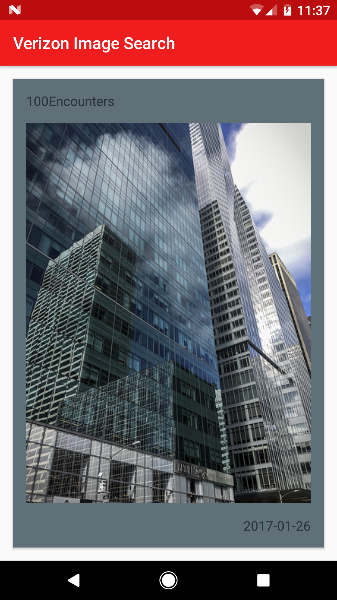

#Verizon-Project
##Verizon Image Search
###Overview:

Verizon app built based on <a href="https://github.com/chris-shum/Verizon-Project/blob/master/Android%20Exercise.pdf">this wireframe</a>.

###Requirements:
- Grabs images from known API and displays them in a gridview
- Allows users to click on image to see larger version and display details of images

###API used:
- <a href = "https://www.flickr.com/services/api/">Flickr</a>

###Libraries used:
- <a href = "https://square.github.io/retrofit/">Retrofit</a>
- <a href = "http://jakewharton.github.io/butterknife/">Butter Knife</a>
- <a href = "http://square.github.io/picasso/">Picasso</a>
- <a href = "https://github.com/florent37/PicassoPalette">Picasso Palette</a>
 
###Video:
<a href = "https://youtu.be/T26-UVpa0s8">YouTube</a>

###Screenshots:
 
 
 
